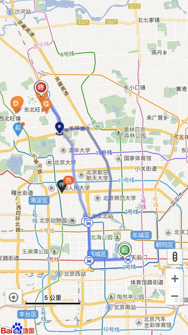

### 组件库


| 组件名                | 说明        | 地址                                         |
|--------------------|-----------|--------------------------------------------|
| iwe7-flex          | flex布局组件  | https://github.com/iwe7/iwe7-flex          |
| iwe7-map           | 百度地图组件    | https://github.com/iwe7/iwe7-map           |
| iwe7-im            | IM组件      | https://github.com/iwe7/iwe7-im            |
| iwe7-icss          | rxjs操作css | https://github.com/iwe7/iwe7-icss          |
| iwe7-core          | 核心库       | https://github.com/iwe7/iwe7-core          |
| iwe7-script        | 加载css和js  | https://github.com/iwe7/iwe7-script        |
| iwe7-util          | 加载css和js  | https://github.com/iwe7/iwe7-util          |
| iwe7-square        | 正方形组件     | https://github.com/iwe7/iwe7-square        |
| iwe7-better-scroll | 滑动组件      | https://github.com/iwe7/iwe7-better-scroll |
| iwe7-web-storage   | 缓存相关      | https://github.com/iwe7/iwe7-web-storage   |
| iwe7-url           | api链接便签   | https://github.com/iwe7/iwe7-url           |


### 百度地图组件




* 布局

| selector      | 说明   |
|---------------|------|
| map-outlet    | 地图布局 |
| map-container | 地图实例 |

* 定位

| selector     | 说明     |
|--------------|--------|
| [mapContent] | 地图内容区  |
| [mapOptions] | 地图参数调整 |

- mapOptions

```ts
// 当前城市
@Input() currentCity: string;
// 缩放
@Input() zoom: number = 11;
@Input() maxZoom: number;
@Input() minZoom: number;
// 鼠标样式
@Input() defaultCursor: string;
@Input() draggingCursor: string;
// 经纬度
@Input() lat: any;
@Input() lng: any;

@Input() offsetX: number;
@Input() offsetY: number;

// 
@Input() dragging: boolean = true;
@Input() scrollWheelZoom: boolean = true;
@Input() doubleClickZoom: boolean = true;
@Input() keyboard: boolean = true;

@Input() inertialDragging: boolean = false;
@Input() continuousZoom: boolean = false;
@Input() pinchToZoom: boolean = true;
@Input() autoResize: boolean = true;
@Input() mapType: any;
```

* 控件

| selector             | 说明    |
|----------------------|-------|
| [customControl]      | 自定义控件 |
| [customOverlay]      | 自定义遮罩 |
| [geolocationControl] | 定位控件  |
| [navigationControl]  | 导航控件  |
| [scaleControl]       | 比例尺控件 |
| [trafficControl]     | 流量控件  |


* 事件

```ts
[mapRightclick],[mapRightdblclick],[mapMaptypechange],
    [mapMousemove],[mapMouseover],[mapMouseout],
    [mapMovestart],
    [mapMoving],
    [mapMoveend],
    [mapZoomstart],
    [mapZoomend],
    [mapAddoverlay],
    [mapAddcontrol],
    [mapRemovecontrol],
    [mapRemoveoverlay],
    [mapClearoverlays],
    [mapDragstart],
    [mapDragging],
    [mapDragend],
    [mapAddtilelayer],
    [mapRemovetilelayer],
    [mapLoad],
    [mapResize],
    [mapHotspotclick],
    [mapHotspotover],
    [mapHotspotout],
    [mapTilesloaded],
    [mapTouchstart],
    [mapTouchmove],
    [mapTouchend],
    [mapLongpress] 
```

| selector | 说明     |
|----------|--------|
| ...      | 监听地图事件 |

* 方法

| selector    | 说明 |
|-------------|----|
| localSearch | 搜索 |
| zoomIn      | 缩小 |
| zoomOut     | 放大 |


* 遮罩

| selector    | 说明 |
|-------------|----|
| map-overlay | 遮罩 |

* pane

| selector       | 说明            |
|----------------|---------------|
| [getContainer] | map container |


```ts
[mapPane]      
 'floatPane' ,
 'floatShadow' ,
 'labelPane' , 
 'mapPane' ,
 'markerMouseTarget' , 
 'markerPane' , 
 'markerShadow' , 
 'vertexPane' 
```

* 转换

| selector    | 说明        |
|-------------|-----------|
| getPoint    | 字符串转point |
| getLocation | point转地址  |


* 导航

| selector      | 说明   |
|---------------|------|
| driving-route | 开车导航 |
| transit-route | 公交导航 |
| walking-route | 步行导航 |

#### mapPane
> 此类表示地图上所有覆盖物的容器集合，没有构造函数，通过对象字面量形式表示。通过Map的getPanes方法可获得该对象实例。

| selector            | type        | 简介               |
|---------------------|-------------|------------------|
| [floatPane]         | HTMLElement | 信息窗口所在的容器        |
| [markerMouseTarget] | HTMLElement | 标注点击区域所在的容器      |
| [floatShadow]       | HTMLElement | 信息窗口阴影所在的容器      |
| [labelPane]         | HTMLElement | 文本标注所在的容器        |
| [markerPane]        | HTMLElement | 标注图标所在的容器        |
| [markerShadow]      | HTMLElement | 标注阴影所在的容器        |
| [mapPane]           | HTMLElement | 折线、多边形等矢量图形所在的容器 |


```html

<map-outlet [height]="height">
  <map-container></map-container>
  <div mapOptions currentCity="北京" [zoom]="zoom" [lat]="lat" [lng]="lng"></div>
  <div (mapMoveend)="mapMoveend($event)"></div>
  <div mapPane="floatPane">
    <map-overlay [lat]="lat" [lng]="lng">
      
    </map-overlay>
  </div>
  <div mapPane="labelPane">
    <map-overlay [lat]="lat-0.1" [lng]="lng">
      <badge-outlet>
        
        <div badgeDot [top]="7" right="10"></div>
      </badge-outlet>
    </map-overlay>
    <map-overlay [lat]="lat" [lng]="lng-0.1">
      <badge-outlet>
        
        <div badgeText [top]="5" right="5">热</div>
      </badge-outlet>
    </map-overlay>
  </div>
  <span (geolocationControl)="geolocationControl($event)"></span>
  <span navigationControl></span>
  <span scaleControl></span>
  <span trafficControl></span>

  <div customControl>
      自定义控件
  </div>

  <div transitRoute start="天安门" end="百度大厦"></div>
  <div drivingRoute start="天安门" end="百度大厦"></div>
  <div walkingRoute start="天安门" end="百度大厦"></div>
</map-outlet>
```